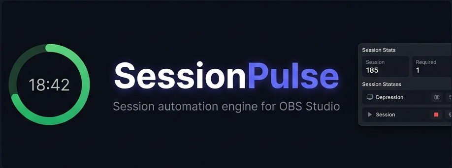
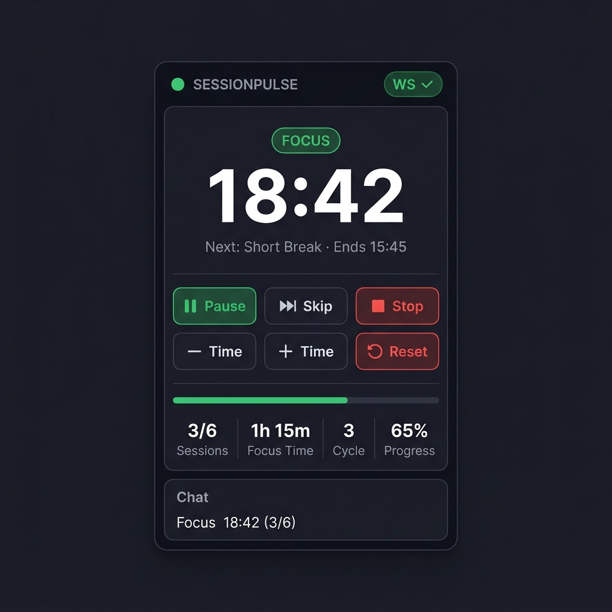
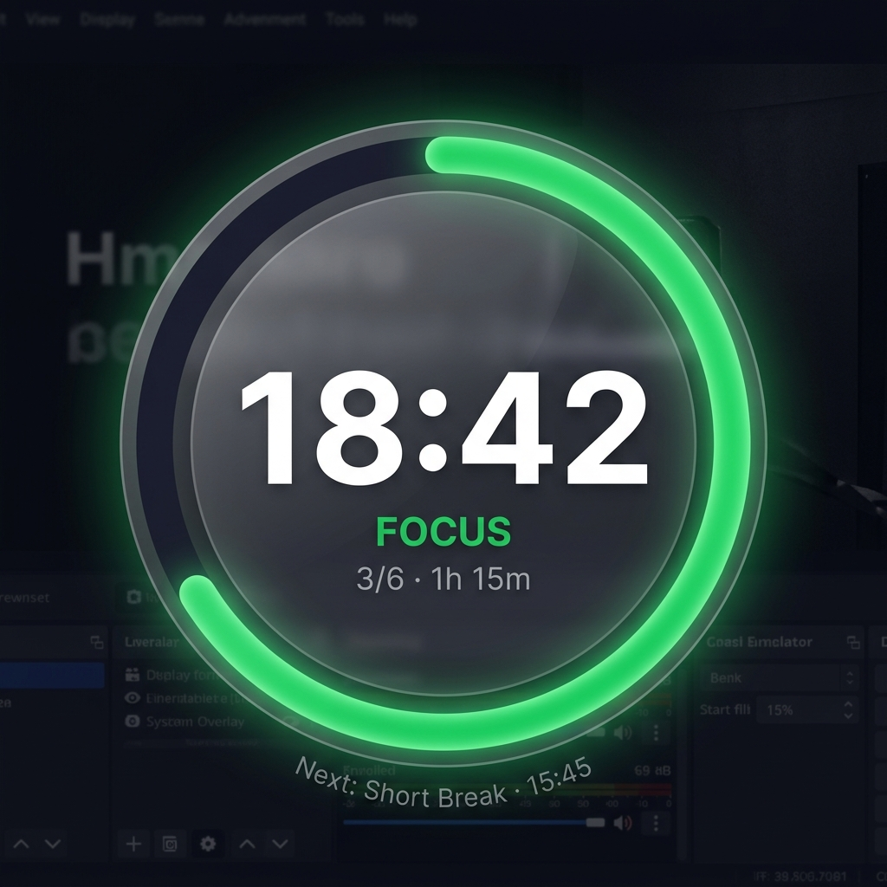
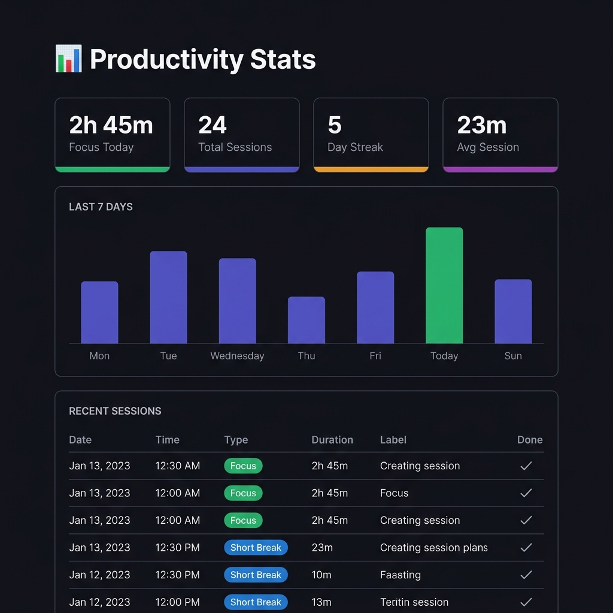

# SessionPulse

**Session automation engine for OBS Studio** — Pomodoro timer, source-level automation, overlays, and more.



> One script. Zero dependencies. Full automation.

SessionPulse turns OBS into a productivity cockpit. Start a focus timer, and it handles everything inside your current scene: ducking music, muting your mic, swapping background images or videos, playing alerts, and updating overlays automatically. When the session ends, it moves into the next timer phase and reverses the source-level automation without relying on OBS scene switching.

---

## ✨ Features

| Category | What It Does |
|----------|-------------|
| **Timer Modes** | Pomodoro, Stopwatch, Countdown, Custom Intervals |
| **Volume Ducking** | Smooth fade between focus/break volume levels |
| **Mic Control** | Auto-mute during focus, unmute during breaks |
| **Filter Toggle** | Enable/disable OBS filters per session |
| **Source Visibility** | Hide distracting sources during focus |
| **Warning Alerts** | 5-min, 1-min, and break-ending sound alerts |
| **Chapter Markers** | Auto-insert recording chapters at transitions |
| **Session Labels** | Name what you're working on — tracked in CSV |
| **Daily Focus Goal** | Set a target, track progress in the dock |
| **Status Messages** | Show AFK/BRB/custom messages with optional auto-clear |
| **Focus Streak** | Track consecutive completed focus sessions 🔥 |
| **Overlays** | Circular ring + horizontal bar (themeable) |
| **Control Dock** | Clickable buttons inside OBS via WebSocket |
| **Mobile Remote** | Control from your phone over WiFi |
| **Stats Dashboard** | 7-day chart, streaks, completion rate |
| **State File API** | 39-field JSON updated every second for integrations |
| **Session Logging** | CSV history for analytics |
| **Persistence** | Survives OBS restarts with atomic saves, a clean public state file, and resume-from-saved-point recovery |

---

## 🚀 Quick Start

### 1. Load the Script

1. Download or `git clone https://github.com/bhaskarjha-com/sbobs.git`
2. In OBS: **Tools → Scripts → + → select `session_pulse.lua`**

### 2. One-Click Setup

Click **🚀 Quick Setup** in the script panel. Done.

This creates the **ring overlay**, **bar overlay**, background image/video/music sources with **default session-matched backgrounds**, and the alert source, adds them to your current scene, and wires them into the script. For individual text sources (SP Timer, SP Session, etc.), see [`docs/overlay-customization.md`](docs/overlay-customization.md#manual-text-sources-advanced).

If OBS closes or crashes mid-session, use **Resume Previous Session** to continue from the exact saved point, including the timer's progress position.

### 3. Set Hotkeys

**Settings → Hotkeys → search "SessionPulse":**

| Hotkey | Suggested | Action |
|--------|-----------|--------|
| Start / Pause | `F9` | Toggle timer |
| Stop | `F10` | End session |
| Skip | `F11` | Next session |

### 4. Press Start

Hit your Start hotkey. Watch the magic.

> **Full walkthrough:** [Getting Started Guide](docs/getting-started.md)

---

## 📸 Screenshots

| Control Dock | Ring Overlay | Stats Dashboard |
|:---:|:---:|:---:|
|  |  |  |

---

## 📖 Documentation

| Guide | Description |
|-------|-------------|
| [Getting Started](docs/getting-started.md) | Zero-to-hero setup in ~10 minutes |
| [Automation Guide](docs/automation-guide.md) | Backgrounds, music, volume ducking, mic, filters, chapters |
| [Overlay Customization](docs/overlay-customization.md) | Themes, colors, sizes via OBS Custom CSS |
| [Mobile Remote](docs/mobile-remote.md) | Control from your phone |
| [Integrations](docs/integrations.md) | Nightbot, Stream Deck, custom tools |
| [FAQ & Troubleshooting](docs/faq.md) | 30+ issues organized by category |
| [Architecture](docs/architecture.md) | Developer reference: state machine, code map, data flows |

---

## 🏗️ Project Structure

```
session_pulse.lua          ← Core engine (Lua, runs inside OBS)
                              ↓ writes
                         session_state.json    ← Public state API (39 fields, updated every second)
                         session_resume.json   ← Internal recovery snapshot for Resume Previous Session
                              ↑ reads
┌──────────────────┬──────────────────┬────────────────┬──────────────┐
│ timer_dock.html  │ timer_overlay.html│ timer_stats.html│ timer_remote.html │
│ (Control Dock)   │ (Ring Overlay)   │ (Stats Page)   │ (Mobile)     │
│ WebSocket + Poll │ Poll only        │ CSV + Poll     │ WebSocket    │
└──────────────────┴──────────────────┴────────────────┴──────────────┘
timer_overlay_bar.html     ← Horizontal bar overlay (Poll only)
shared.js                  ← ES module utilities for custom integrations
```

---

## 📊 State File API

`session_state.json` is the integration point — any tool that reads JSON can connect.

`session_resume.json` is separate on purpose: it is an internal recovery snapshot for the Resume Previous Session flow, not the public integration contract.

<details>
<summary><strong>All 39 fields</strong> (click to expand)</summary>

```json
{
  "version": "5.4.1",
  "timer_mode": "pomodoro",
  "is_running": true,
  "is_paused": false,
  "session_type": "Focus",
  "current_time": 1234,
  "total_time": 1500,
  "elapsed_seconds": 266,
  "progress_percent": 18,
  "ends_at": "15:45",
  "cycle_count": 1,
  "completed_focus_sessions": 2,
  "goal_sessions": 6,
  "total_focus_seconds": 3000,
  "show_transition": false,
  "transition_message": "",
  "custom_segment_name": "",
  "custom_segment_index": 1,
  "custom_segment_count": 0,
  "is_overtime": false,
  "overtime_seconds": 0,
  "next_session_type": "Short Break",
  "next_session_in": 1234,
  "sessions_remaining": 4,
  "break_suggestion": "Stretch!",
  "stream_duration": 7200,
  "chat_status_line": "Focus 20:34 (2/6)",
  "session_label": "Math homework",
  "daily_focus_seconds": 7200,
  "daily_goal_seconds": 14400,
  "status_active": false,
  "status_message": "",
  "status_until_epoch": 0,
  "focus_streak": 2,
  "session_epoch": 1711983000,
  "session_pause_total": 0,
  "session_target_duration": 1500,
  "resume_available": false,
  "timestamp": 1711983266
}
```

</details>

**Usage examples:** [Integrations Guide](docs/integrations.md)

---

## 🧪 Testing

```bash
# Lua core tests (72 tests)
lua tests/test_session_pulse.lua

# Lua runtime queue tests (79 tests)
lua tests/test_runtime_queue.lua

# JavaScript frontend tests (104 tests)
node tests/test_frontend.js
```

CI runs on every push via [GitHub Actions](.github/workflows/test.yml).

---

## 🤝 Contributing

See [CONTRIBUTING.md](CONTRIBUTING.md) for guidelines, architecture overview, and the manual testing checklist.

---

## 📋 Changelog

See [CHANGELOG.md](CHANGELOG.md) for the full version history.

**Current version:** 5.4.1

---

## 📄 License

[MIT](LICENSE) — Bhaskar Jha
