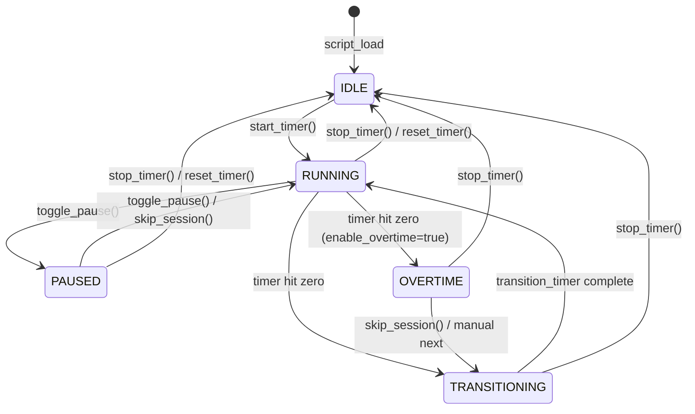
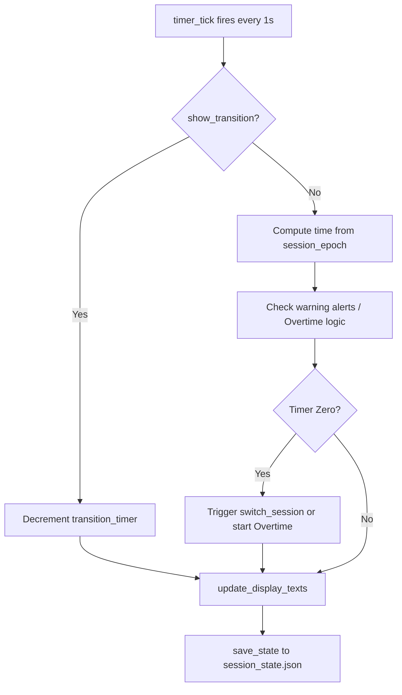
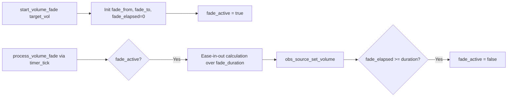

# SessionPulse — Developer Architecture Reference

## 1. File Structure
While SessionPulse is distributed as a single Lua script for ease of installation, the broader project contains:
- `session_pulse.lua`: The main OBS automation engine. Contains all logic.
- `timer_overlay.html`: The browser source overlay used for visual display.
- `docs/`: User-facing documentation and this architecture reference.

## 2. State Machine

The core timer relies on wallclock timing to prevent drift, while the logical flow is bound by `session_type` and these boolean flags:



**Valid Boolean Combinations:**
- **IDLE**: `is_running`=false, `is_paused`=false, `is_overtime`=false
- **RUNNING**: `is_running`=true, `is_paused`=false, `is_overtime`=false
- **PAUSED**: `is_running`=true, `is_paused`=true, `is_overtime`=false
- **OVERTIME**: `is_running`=true, `is_paused`=false, `is_overtime`=true
- **TRANSITIONING**: `is_running`=true, `show_transition`=true

## 3. Code Map

The script is divided into exactly 23 sections, labeled with standard `---` comment headers outlining purpose and functions.

1. **State Variables**: Runtime booleans and numeric trackers (`current_time`, `session_epoch`).
2. **Configuration**: Setting values loaded from OBS (`timer_mode`, string paths).
3. **Hotkey IDs**: Handles mapped to physical keyboard triggers.
4. **Helpers**: Formatting, math, and JSON text processing.
5. **Session History Log**: Appends sessions to `session_history.csv`.
6. **Session Persistence**: Saves/Loads `session_state.json` via atomic writes.
7. **OBS Source Interaction**: Modifies OBS Text, Media, and Browser sources.
8. **Scene Switching**: Switches `SP Focus` / `SP Break`.
9. **Mic Control**: Toggles muted state.
10. **Source Visibility**: Enables/disables comma-separated sources.
11. **Volume Ducking**: Ease-in-out audio fades.
12. **Filter Toggle**: Turns OBS filters on/off.
13. **Chapter Markers**: Injects timestamps into active recordings.
14. **Display**: Progress bar logic, session string formulation.
15. **Session Management**: Resolves `session_type` transitions orchestrating all sources.
16. **Timer**: The 1-second `timer_tick` driving the system.
17. **Controls**: API wrappers for pausing, stopping, and time modifications.
18. **Hotkey Callbacks**: Thin integration layer to the Controls.
19. **Frontend Events**: Hooks for stream/recording toggles.
20. **Source/Scene Enumeration**: OBS SDK dropdown population logic.
21. **Quick Setup Wizard**: Automated source and scene generator for first-timers.
22. **OBS Script Interface**: Standard OBS `script_properties` and `script_update`.
23. **Lifecycle**: OBS `script_load`, `script_save`, `script_unload`.

## 4. Data Flow Diagrams

### Timer Tick Cycle


### Volume Fade Pipeline


## 5. OBS API Reference

Major interactions with the OBS runtime:
- `obs_get_source_by_name`: Finds a source reference (must be released with `obs_source_release`).
- `obs_source_update`: Pushes updated properties (text strings, files) to a source.
- `obs_frontend_set_current_scene`: Switches scenes automatically.
- `obs_source_set_muted` / `obs_source_set_volume`: Audio automation.
- `obs_source_set_enabled` / `obs_source_filter_set_enabled`: Toggles visibility/filters.
- `obs_properties_create`: Generates the UI displayed in OBS under Scripts.

> [!NOTE]
> `obs_source_filter_set_enabled` requires OBS 30.2+, so `set_filter_enabled` implements a `pcall` fallback for older versions.

## 6. Configuration Contract

Changes to UI fields trigger `script_update`.
Key paths:
- Text values flow immediately into memory via `obs_data_get_string()`.
- Durations are mapped from minutes (UI) into seconds (`* 60`) within `update_timer_config()`.
- Missing UI configurations are guarded by checking `if not str or str == ""` before usage to avoid memory faults.

## 7. Debugging Guide

| Symptom | Diagnosis / Where to look |
|---------|---------------------------|
| **Timer doesn't tick** | Ensure OBS isn't frozen. Verify `timer_add` in Lifecycle (`script_load`). Ensure `is_running` is true and `is_paused` is false. |
| **State file corrupts** | Look at Section 6: Session Persistence. The JSON parser is manually built via `string.match` (no Lua JSON lib included in OBS). Verify `json_escape`. |
| **Volume doesn't fade** | Section 11: Volume Ducking. Ensure `volume_source_name` exactly matches OBS spelling. Check `enable_volume_fade` config. |
| **Quick Setup buttons greyed / "(None)" listed** | Section 21. OBS caches properties; property recreation inside `script_update` forces a refresh of `populate_scene_list`. |
| **Timer drifts by seconds over hours** | Compare `compute_current_time()` against `os.time()` and `session_epoch`. The wallclock logic depends on `session_pause_total` accounting correctly for interruptions. |

## 8. JSON State Schema
`session_state.json` provides an integration point for custom docks/alerts.
```json
{
  "version": "5.4.1",
  "timer_mode": "pomodoro",
  "is_running": true,
  "is_paused": false,
  "session_type": "Focus",
  "current_time": 1500,
  "elapsed_seconds": 0,
  "progress_percent": 0,
  "ends_at": "17:45",
  "total_focus_seconds": 6000,
  "is_overtime": false,
  "session_epoch": 1711983000
}
```

## 9. CSV Log Schema
Stored in `session_history.csv`:
`date,time,session_type,duration_seconds,completed,mode,total_focus,label`
`"2026-04-02","15:30:00","Focus",1500,true,"pomodoro",1500,"Writing Docs"`

## 10. Known Gotchas & Design Decisions

- **Single Lua File Architecture:** We actively chose to maintain a single Lua file (2300+ lines) instead of modularizing. OBS Lua's module system does not natively include script paths in `package.path`, and the isolated global variables make shared states precarious.
- **Wallclock vs Tick-based Timer:** Previous versions relied on `timer_tick` decrementing a counter, which caused massive drift during lag. V5.0+ migrated strictly to wallclock metrics comparing `os.time()` against `session_epoch`.
- **Atomic Writes:** Generating `.tmp` file and running `os.rename` guarantees that external watchers (like Streamer.bot or web dashboards) never read a half-written `session_state.json`.
