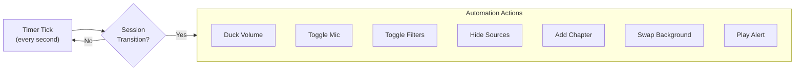
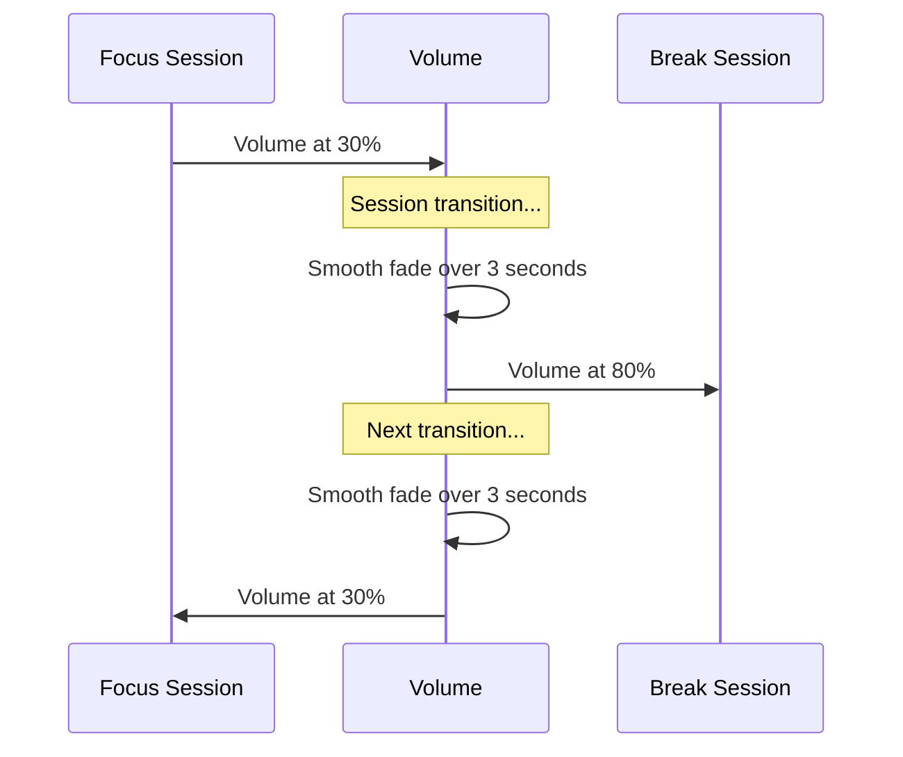

# Automation Guide

SessionPulse can automate nearly every aspect of your OBS setup based on your session state. This guide covers each automation feature with step-by-step setup.

---

## How Automation Works



All automation triggers on **session transitions** (Focus → Break, Break → Focus), not every tick. This means zero performance impact during sessions.

---

## Scene Layouts

SessionPulse no longer switches OBS scenes automatically. The stable workflow is to keep the timer inside your current scene and let the script automate sources, audio, filters, overlays, and alerts there.

### Recommended setup

1. Build your Focus and Break presentation using sources or groups inside a stable scene
2. Let SessionPulse handle source visibility, audio ducking, overlays, text, and alerts
3. If you need a completely different scene, switch it manually or use a dedicated scene-management tool outside SessionPulse

---

## Volume Ducking

Smoothly fade music volume between focus and break levels.

### Setup

1. You need a **media source** in OBS that plays music (e.g., `Background Music`)
2. In script settings, find the **Volume Ducking** section
3. Set:
   - **Ducking Target Source** → select your music source (usually `SP Background Music`)
   - **Focus Volume %** → `30` (quiet during focus)
   - **Break Volume %** → `80` (louder during breaks)
   - **Smooth Volume Fade** → ✅ enabled
   - **Fade Duration** → `3` seconds (1–15 range)

### How It Works



The fade uses ease-in-out interpolation — not a jarring jump.

### Tips

- **0%** = completely silent, **100%** = full volume
- The fade continues even if you pause the timer mid-fade
- You can set Focus to `0%` to completely silence music during deep work

---

## Mic Control

Auto-mute your microphone during focus, unmute during breaks.

### Setup

1. In script settings, find the **Microphone Control** section
2. Set:
   - **Microphone Source** → select your mic source (e.g., `Mic/Aux`)
   - **Mute during Focus** → ✅ enabled

### Behavior

| Session | Mic State |
|---------|-----------|
| Focus | 🔇 Muted |
| Short Break | 🔊 Unmuted |
| Long Break | 🔊 Unmuted |
| Timer stopped | *(no change)* |

### Use Case

Perfect for "Study With Me" streams where you're silent during focus but interact with chat during breaks.

---

## Filter Toggling

Enable or disable source filters based on session type.

### Setup

1. First, **add a filter** to a source in OBS:
   - Right-click a source → **Filters**
   - Add a filter (e.g., **Color Correction**, **Blur**, **LUT**)
   - Note the exact filter name
2. In script settings, find the **Filter Toggle** section
3. Set:
   - **Source** → the source that has the filter
   - **Enable During Focus** → comma-separated filter names to ENABLE during focus
   - **Disable During Focus** → comma-separated filter names to DISABLE during focus

### Examples

| Setup | Enable During Focus | Disable During Focus |
|-------|-------------------|---------------------|
| Grayscale during focus | `Color Correction` | |
| Remove blur during focus | | `Background Blur` |
| Multiple filters | `Focus LUT,Vignette` | `Chat Highlight` |

### How It Works

- Filters listed in "Enable During Focus" are **turned ON** when Focus starts, **turned OFF** when Break starts
- Filters listed in "Disable During Focus" do the opposite
- Filter names must match exactly (case-sensitive)

---

## Source Visibility

Hide or show specific sources based on session type.

### Setup

1. In script settings, find **Sources to Hide During Focus**
2. Enter source names, **comma-separated**: `Chat Box,Alert Box,Donation Ticker`

| Session | These sources are... |
|---------|---------------------|
| Focus | 👻 Hidden |
| Break | 👁️ Visible |

### Use Case

Hide chat, donation alerts, and other distractions during focused work sessions.

---

## Background Visuals

Swap background images or videos per session type.

### Setup

1. Add an **Image Source** or **Media Source** to your scene for the background.
   Quick Setup already creates both `SP Background Image` and `SP Background Video`.
2. In script settings, set:
   - **Background Visual Source** → choose the image source or the video source
   - If you chose an image source:
     - **Focus Image**
     - **Short Break Image**
     - **Long Break Image**
   - If you chose a video source:
     - **Focus Video**
     - **Short Break Video**
     - **Long Break Video**

The source's file will be swapped at each transition.

---

## Background Music

Run a looping music bed separately from your background visuals and alert sounds.

### Setup

1. Add a **Media Source** to your scene for music.
   Quick Setup already creates a placeholder named `SP Background Music` for this.
2. In script settings:
   - **Background Music Source** → select the media source
   - **Looping Music Track** → choose the audio file to loop
   - **Ducking Target Source** → point to the same music source if you want Focus/Break volume automation

### Behavior

- Music starts when the timer starts
- Music stops when the timer stops
- Volume ducking changes its level between Focus and Break if selected as the ducking target

---

## Chapter Markers

Automatically insert recording chapter markers at session transitions.

### Requirements

- OBS Studio **30.2+** (chapter marker API was added in this version)

### Setup

1. In script settings, enable **Add Recording Chapter Markers** ✅
2. Start a recording in OBS
3. Each session transition automatically adds a chapter with the session name

### Result

Your recorded video will have chapters like:
```
00:00 Focus
25:00 Short Break
30:00 Focus
55:00 Short Break
60:00 Focus
85:00 Long Break
```

Chapters appear in video players (VLC, YouTube) for easy navigation.

---

## Warning Alerts

Play sounds before session transitions so you're not caught off-guard.

### Setup

1. Add a **Media Source** to your scene for alert sounds.
   Quick Setup already creates a placeholder named `SP Alert Sound` for this.
2. In script settings:
   - **Alert Sound Source** → select the media source
   - Set your audio files:
     - **Focus Start Sound** → sound when focus begins
     - **Break Start Sound** → sound when break begins
   - Enable warnings:
     - **5-Minute Warning** ✅
     - **1-Minute Warning** ✅
     - **Break Ending Warning** ✅
     - **Break Warning At** → `30` seconds before break ends

### Behavior

```
Focus Session (25 min)
├── 20:00 — ⏰ 5-minute warning sound
├── 24:00 — ⏰ 1-minute warning sound
└── 25:00 — 🔔 Break start sound

Short Break (5 min)
├── 4:30  — ⏰ Break ending warning (30s before)
└── 5:00  — 🔔 Focus start sound
```

---

## Stream-Aware Automation

Automatically start/stop the timer based on your stream state.

### Setup

1. In script settings:
   - **Auto-start timer on Stream Start** ✅
   - **Auto-stop timer on Stream End** ✅

### Behavior

| Event | Action |
|-------|--------|
| You click "Start Streaming" | Timer automatically starts |
| You click "Stop Streaming" | Timer automatically stops |
| Stream crashes/disconnects | Timer stops (OBS fires the end event) |

This means you never forget to start your timer — it's tied to your stream lifecycle.

---

## Custom Intervals

Create any sequence of timed segments beyond the Pomodoro format.

### Format

```
Name:Minutes,Name:Minutes,Name:Minutes
```

### Recipes

| Use Case | Config | 
|----------|--------|
| **HIIT Workout** | `Warm-up:5,Exercise:20,Rest:5,Exercise:20,Cool-down:5` |
| **Podcast** | `Intro:2,Guest:25,Ads:3,Discussion:20,Outro:2` |
| **Study Blocks** | `Review:10,Practice:30,Break:5,Practice:30,Break:5` |
| **Art Stream** | `Sketch:15,Ink:30,Break:10,Color:30,Break:10` |
| **Speed Run** | `Attempt:15,Review:5` |
| **Event / Talk** | `Opening:5,Talk:20,Q&A:10,Break:5` |

### How It Works

- Segments cycle in order, then loop back to the first
- Each segment name appears as the session message
- All other automation (volume, visibility, filters, overlays) treats non-"Break" names as focus time

### Setup

1. Set **Timer Mode** → **Custom Intervals**
2. Enter your config in the **Custom Intervals** text field
3. The overlay and dock will show the segment name instead of "Focus" or "Break"
