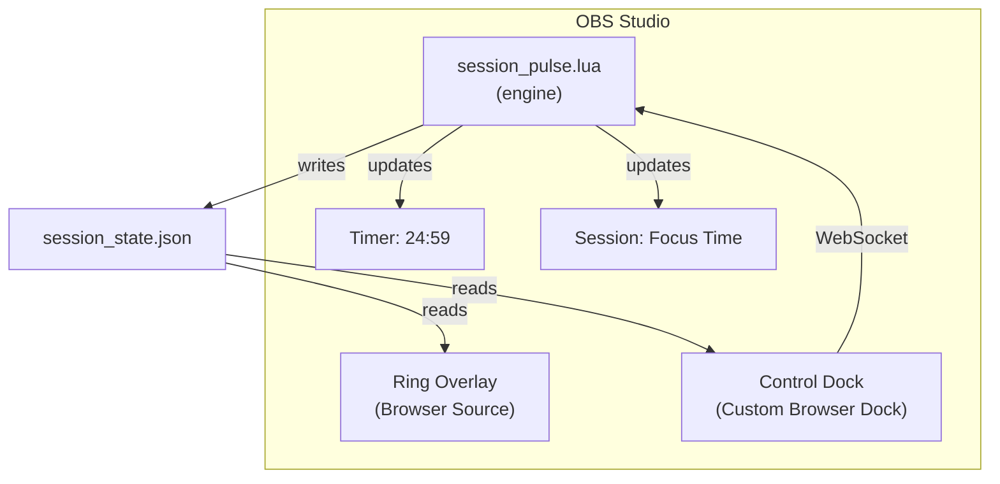

# Getting Started with SessionPulse

> **Time to complete:** ~10 minutes  
> **Prerequisite:** OBS Studio 28+ installed ([download here](https://obsproject.com))

This guide takes you from zero to a fully running Pomodoro timer with overlay — no prior OBS scripting experience needed.

---

## Step 1: Download SessionPulse

**Option A — Git clone** (recommended):
```bash
git clone https://github.com/bhaskarjha-com/sbobs.git
```

**Option B — Download ZIP:**
1. Go to the [GitHub repo](https://github.com/bhaskarjha-com/sbobs)
2. Click the green **Code** button → **Download ZIP**
3. Extract the ZIP to a permanent location (e.g., `D:\tools\SessionPulse\`)

> ⚠️ **Important:** Don't put it in a temporary folder. OBS remembers the script path — if you move it later, OBS won't find it.

---

## Step 2: Load the Script in OBS

1. Open **OBS Studio**
2. Go to **Tools** → **Scripts**
3. Click the **+** button (bottom-left)
4. Navigate to where you extracted SessionPulse
5. Select **`session_pulse.lua`**
6. Click **Open**

You should see the script appear in the scripts list. The Script Log (bottom panel) should show:

```
[SessionPulse] Loaded v5.4.1
[SessionPulse] State saved → session_state.json
```

If you see errors instead, check the [FAQ](faq.md).

---

## Step 3: Quick Setup (Recommended) 🚀

Click **one button** and SessionPulse creates everything for you:

1. In the script settings panel (right side), click **🚀 Quick Setup**
2. Done.

This automatically:
- ✅ Creates 4 text sources (`SP Timer`, `SP Session`, `SP Count`, `SP Progress`)
- ✅ Creates a ring overlay Browser Source (`SP Overlay`)
- ✅ Creates placeholder background sources (`SP Background Image`, `SP Background Video`, `SP Background Music`)
- ✅ Creates an alert Media Source (`SP Alert Sound`)
- ✅ Adds them to your currently active scene
- ✅ Wires all sources to the script dropdowns

Check the Script Log to confirm:
```
[SessionPulse] Quick Setup: ✓ Complete! Created 9 items. Press Start to begin!
```

> **Skip to [Step 4: Set Up Hotkeys](#step-4-set-up-hotkeys)** — sources, scenes, and overlay are ready.

If OBS closes during a session, reopen OBS and use **Resume Previous Session** in the script panel to continue from the exact saved timer value and progress position.

---

<details>
<summary><strong>Alternative: Manual Setup</strong> (if you prefer to create sources yourself)</summary>

### Create Text Sources

Create these in your scene before configuring the script:

| Source Name | Purpose | Required? |
|------------|---------|-----------|
| `Timer` | Shows countdown `24:59` | ✅ Yes |
| `Session` | Shows `Focus Time`, `Short Break`, etc. | Recommended |
| `Focus Count` | Shows `Done: 3/6` | Optional |
| `Progress` | Shows `████░░░░` bar | Optional |

1. In your **Scene**, click **+** (under Sources)
2. Select **Text (GDI+)** (Windows) or **Text (FreeType 2)** (Mac/Linux)
3. Name it and click **OK**
4. Repeat for each source

### Connect Sources to the Script

1. Go to **Tools** → **Scripts** → select **SessionPulse**
2. In the script settings panel, use the dropdown menus:
   - **Timer Text Source** → select your timer source
   - **Session Message Source** → select your session source
   - **Focus Count Source** → select your count source
   - **Progress Bar Source** → select your progress source

</details>

---

## Step 4: Set Up Hotkeys

SessionPulse uses OBS hotkeys to control the timer. Set them up:

1. Go to **Settings** → **Hotkeys**
2. Scroll down or search for **SessionPulse**
3. Assign keys to at least these:

| Hotkey | Suggested Key | What It Does |
|--------|--------------|--------------|
| **Start / Pause** | `F9` | Toggle timer on/off |
| **Stop** | `F10` | End current session completely |
| **Skip Session** | `F11` | Jump to next session type |

Optional but useful:

| Hotkey | Suggested Key | What It Does |
|--------|--------------|--------------|
| Add Time | `Ctrl+F9` | Add 5 minutes to current session |
| Subtract Time | `Ctrl+F10` | Remove 5 minutes from current session |
| Reset All | `Ctrl+F11` | Clear all progress and start fresh |

4. Click **Apply** → **OK**

---

## Step 5: Start Your First Session

1. Press your **Start/Pause** hotkey (e.g., `F9`)
2. Watch: your `Timer` source should start counting down from `25:00`
3. Your `Session` source should show `Focus Time`
4. When it hits `0:00`, it will automatically switch to a **Short Break** (5 minutes)
5. After the break, it auto-starts the next Focus session

**Default Pomodoro cycle:**
```
Focus (25 min) → Short Break (5 min) → Focus → Short Break → Focus → Short Break → Focus → Long Break (15 min)
```

> 💡 **Tip:** You can change all durations in the script settings (Tools → Scripts → select SessionPulse).

---

## Step 6: Add the Overlay (Optional)

The ring overlay adds a beautiful visual timer to your stream:

1. In your scene, click **+** (add source) → **Browser**
2. Name it `Timer Overlay`
3. Check **✅ Local file**
4. Click **Browse** → navigate to your SessionPulse folder → select **`timer_overlay.html`**
5. Set **Width: 220**, **Height: 220**
6. Click **OK**
7. Position the overlay where you want it on your stream

You should see a circular ring with the countdown timer. It will be green during Focus, blue during Short Break, and purple during Long Break.

> For customization (themes, colors, sizes), see the [Overlay Customization Guide](overlay-customization.md).

---

## Step 7: Add the Control Dock (Optional)

The dock gives you clickable buttons inside OBS instead of using hotkeys:

1. Go to **View** → **Docks** → **Custom Browser Docks**
2. Fill in:
   - **Dock Name:** `SessionPulse`
   - **URL:** `file:///` + full path to `timer_dock.html`
   
   Examples:
   - Windows: `file:///D:/tools/SessionPulse/timer_dock.html`
   - Mac: `file:///Users/you/SessionPulse/timer_dock.html`
   
3. Click **Apply**

A new dock panel appears with Start/Pause, Skip, Stop buttons, a timer display, and session stats.

**For control buttons to work**, you need WebSocket enabled:
1. Go to **Tools** → **WebSocket Server Settings**
2. Check **✅ Enable WebSocket server**
3. Note the port (default: `4455`)
4. If you set a password, add `?ws_password=YOUR_PASSWORD` to the dock URL

---

## You're Done! 🎉

Your setup should now look like this:



---

## Next Steps

| Want to... | Read... |
|-----------|---------|
| Customize overlay colors and themes | [Overlay Customization](overlay-customization.md) |
| Auto-switch scenes, duck music, control mic | [Automation Guide](automation-guide.md) |
| Set up Nightbot or Stream Deck | [Integrations](integrations.md) |
| Control from your phone | [Mobile Remote](mobile-remote.md) |
| Something isn't working | [FAQ & Troubleshooting](faq.md) |
