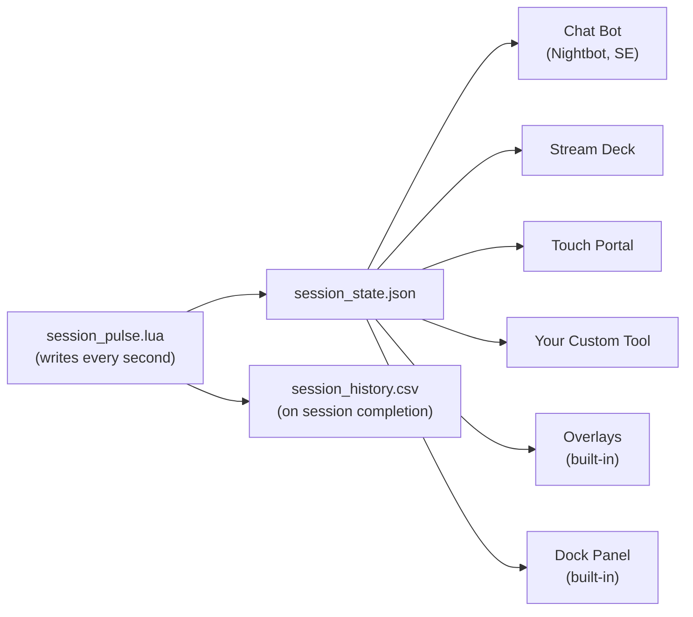

# Integrations Guide

SessionPulse exposes timer state through `session_state.json` — a file that updates every second with 35+ fields. Any tool that can read a JSON file or receive HTTP can integrate with it.

---

## Architecture



---

## Chat Bots

### The `chat_status_line` Field

The simplest integration. The state file contains a pre-formatted string ready for chat:

```json
"chat_status_line": "Focus 20:34 (3/6)"
```

This shows: session type, time remaining, and progress.

### Nightbot

**Option 1 — HTTP server + `$(urlfetch)`:**

1. Serve the SessionPulse folder via HTTP:
   ```bash
   cd /path/to/SessionPulse
   python -m http.server 8080
   ```
2. Create a custom API endpoint that reads the JSON and returns `chat_status_line` (you'll need a small script for this)

**Option 2 — Manual copy from dock:**

1. Open the dock panel in OBS
2. Click the **Chat** row — it copies the status to clipboard
3. Paste into your Nightbot custom command response

### StreamElements / Fossabot

Same approach as Nightbot — either serve the file over HTTP or manually copy the status line.

### Streamer.bot

Streamer.bot can read local files directly:

1. Create a new action triggered by a `!timer` command
2. Add a **Read File** sub-action → path to `session_state.json`
3. Parse the JSON
4. Send `chat_status_line` to chat

```
// Pseudo-code for Streamer.bot C# action
var json = File.ReadAllText(@"D:\SessionPulse\session_state.json");
var state = JsonConvert.DeserializeObject<dynamic>(json);
CPH.SendMessage(state.chat_status_line.ToString());
```

---

## Stream Deck

### Using State File for Display

1. Install a plugin that reads JSON files (e.g., **API Ninja** or **Web Requests**)
2. Point it to `session_state.json` (local file or via HTTP)
3. Display `chat_status_line` or any other field on a key

### Useful Fields for Stream Deck

| Field | Display As |
|-------|-----------|
| `chat_status_line` | `Focus 20:34 (3/6)` |
| `session_type` | Current session name |
| `progress_percent` | Progress bar value |
| `ends_at` | "Ends at 15:45" |
| `focus_streak` | "🔥3 streak" |
| `daily_focus_seconds` | "2h 15m today" |

### Using Hotkeys for Control

Stream Deck natively supports OBS hotkeys:

1. Add a **Hotkey** action on Stream Deck
2. Map it to your SessionPulse hotkeys (F9, F10, etc.)
3. Now your Stream Deck buttons control the timer

---

## Touch Portal

Similar to Stream Deck — use HTTP requests or file reads to display state, and hotkey actions for control.

---

## Custom Tools & Scripts

### Reading the State File

The state file is plain JSON, updated every second:

```python
# Python example
import json, time

while True:
    with open('session_state.json', 'r') as f:
        state = json.load(f)
    
    print(f"{state['session_type']} - {state['current_time']}s remaining")
    print(f"Progress: {state['progress_percent']}%")
    print(f"Focus streak: {state['focus_streak']}")
    
    time.sleep(1)
```

```javascript
// Node.js example
const fs = require('fs');

setInterval(() => {
    const state = JSON.parse(fs.readFileSync('session_state.json', 'utf8'));
    console.log(`${state.session_type} - ${state.chat_status_line}`);
}, 1000);
```

### Serving Over HTTP

For tools that can't read local files:

```bash
# Serve the SessionPulse directory
cd /path/to/SessionPulse
python -m http.server 8080
```

Then fetch from `http://localhost:8080/session_state.json`

### Using `shared.js` for Web UIs

If you're building an HTTP-served custom UI:

```html
<script type="module">
  import { formatTime, getBadgeInfo, formatDuration } from './shared.js';
  
  const response = await fetch('session_state.json');
  const state = await response.json();
  
  const badge = getBadgeInfo(state.session_type);
  document.getElementById('time').textContent = formatTime(state.current_time);
  document.getElementById('badge').textContent = badge.emoji + ' ' + state.session_type;
</script>
```

> **Note:** `shared.js` uses ES module exports and requires HTTP serving — it won't work from `file://` protocol.

### Key Fields Reference

| Field | Type | Description |
|-------|------|-------------|
| `is_running` | boolean | Timer is active |
| `is_paused` | boolean | Timer is paused |
| `session_type` | string | `"Focus"`, `"Short Break"`, `"Long Break"`, or custom |
| `current_time` | number | Seconds remaining |
| `total_time` | number | Total session duration (seconds) |
| `elapsed_seconds` | number | Seconds elapsed in this session |
| `progress_percent` | number | 0–100 progress |
| `ends_at` | string | `"15:45"` — when the session finishes |
| `completed_focus_sessions` | number | Count of completed focus sessions |
| `goal_sessions` | number | Target number of sessions |
| `focus_streak` | number | Consecutive completed focus sessions |
| `chat_status_line` | string | Pre-formatted status string |
| `session_label` | string | User-defined label for the session |
| `daily_focus_seconds` | number | Focus seconds accumulated today |
| `daily_goal_seconds` | number | Daily goal in seconds (0 = disabled) |
| `next_session_type` | string | What comes after this session |
| `is_overtime` | boolean | Timer exceeded zero |
| `overtime_seconds` | number | How far past zero |
| `timestamp` | number | Unix epoch of last update |

Full field list (35 fields) is in the [README State File API section](../README.md#state-file-api).

---

## CSV History

For analytics integrations, SessionPulse logs completed sessions to `session_history.csv`:

```csv
date,time,session_type,duration_seconds,completed,mode,total_focus,label
2026-03-31,10:45:23,Focus,1500,true,pomodoro,1500,"Math homework"
2026-03-31,11:10:25,Short Break,300,true,pomodoro,1500,""
```

Enable in script settings: **Log Sessions to CSV File** ✅

### CSV Fields

| Column | Description |
|--------|-------------|
| `date` | `YYYY-MM-DD` |
| `time` | `HH:MM:SS` |
| `session_type` | Session name |
| `duration_seconds` | Actual duration (may be less than target if skipped) |
| `completed` | `true` if the session reached zero naturally |
| `mode` | `pomodoro`, `stopwatch`, `countdown`, or `custom` |
| `total_focus` | Running total of focus seconds at time of logging |
| `label` | Quoted session label (RFC 4180 CSV format) |

Import into Google Sheets, Excel, or any analytics tool for productivity tracking.
